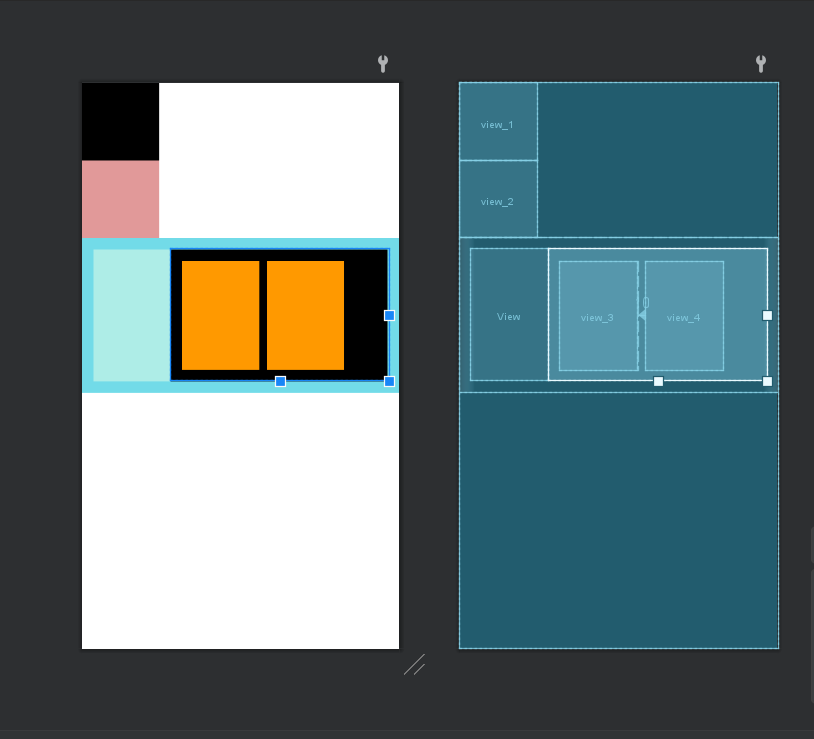

## 布局

### 线性布局 LinearLayOut

```xml
<?xml version="1.0" encoding="utf-8"?>
<LinearLayout xmlns:android="http://schemas.android.com/apk/res/android"
    xmlns:app="http://schemas.android.com/apk/res-auto"
    xmlns:tools="http://schemas.android.com/tools"
    android:layout_width="match_parent"
    android:layout_height="match_parent"
    android:orientation="vertical"
    tools:context=".MainActivity">

    <LinearLayout
        android:id="@+id/ll_1"
        android:layout_width="200dp"
        android:layout_height="200dp"
        android:orientation="vertical" //朝向
        android:background="#85F190"
        android:padding="20dp">
        
        <View
            android:layout_width="match_parent"
            android:layout_height="match_parent"
            android:background="#96EAF4"/>
    </LinearLayout>
    
    <LinearLayout
        android:layout_width="match_parent"
        android:layout_height="200dp"
        android:background="#0066FF"
        android:orientation="horizontal"
        android:layout_marginTop="20dp"
        android:layout_marginLeft="15dp"
        android:layout_marginRight="15dp"
        >

        <View
            android:layout_width="50dp"
            android:layout_height="50dp"
            android:background="#000000"
            android:layout_weight="3"/> // 所占权重，在不确定父组件的宽度或者长度的时使用，用于
        <View
            android:layout_width="50dp"
            android:layout_height="50dp"
            android:background="#ffffff"
            android:layout_weight="5"/>
    </LinearLayout>

</LinearLayout>
```


### 相对布局

```xml
android:layout_alignParentBottom="true" // 放置于父组件的底部与右部
android:layout_alignParentRight="true"

android:layout_toRightOf="@+id/view_1" //放置于view1的右边
android:layout_below="@+id/view_1" //放置于view1的下方

```


```xml
<?xml version="1.0" encoding="utf-8"?>
<RelativeLayout xmlns:android="http://schemas.android.com/apk/res/android"
    xmlns:app="http://schemas.android.com/apk/res-auto"
    xmlns:tools="http://schemas.android.com/tools"
    android:layout_width="match_parent"
    android:layout_height="match_parent"
    android:orientation="vertical"
    tools:context=".MainActivity">

    <View
        android:id="@+id/view_1"
        android:layout_width="100dp"
        android:layout_height="100dp"
        android:background="#000000"/>


    <View
        android:id="@+id/view_2"
        android:layout_width="100dp"
        android:layout_height="100dp"
        android:background="#E19999"
        android:layout_toRightOf="@+id/view_1"/> // 放置于view1的旁边


</RelativeLayout>
```

```xml
<?xml version="1.0" encoding="utf-8"?>
<RelativeLayout xmlns:android="http://schemas.android.com/apk/res/android"
    xmlns:app="http://schemas.android.com/apk/res-auto"
    xmlns:tools="http://schemas.android.com/tools"
    android:layout_width="match_parent"
    android:layout_height="match_parent"
    android:orientation="vertical"
    tools:context=".MainActivity">

    <View
        android:id="@+id/view_1"
        android:layout_width="100dp"
        android:layout_height="100dp"
        android:background="#000000"/>


    <View
        android:id="@+id/view_2"
        android:layout_width="100dp"
        android:layout_height="100dp"
        android:background="#E19999"
        android:layout_below="@+id/view_1"/>
    
    <LinearLayout
        android:id="@+id/ll_1"
        android:layout_width="match_parent"
        android:layout_height="200dp"
        android:layout_below="@+id/view_2"
        android:orientation="horizontal"
        android:padding="15dp"
        android:background="#72DBE8">
        <View
            android:layout_width="100dp"
            android:layout_height="match_parent"
            android:background="#AEEDE7"/>
        <RelativeLayout
            android:layout_width="match_parent"
            android:layout_height="match_parent"
            android:background="#000000"
            android:padding="15dp">
            <View
                android:id="@+id/view_3"
                android:layout_width="100dp"
                android:layout_height="match_parent"
                android:background="#FF9900"/>

            <View
                android:id="@+id/view_4"
                android:layout_width="100dp"
                android:layout_height="match_parent"
                android:background="#FF9900"
                android:layout_toRightOf="@id/view_3"
                android:layout_marginLeft="10dp"/>
        </RelativeLayout>

    </LinearLayout>


</RelativeLayout>
```

**呈现效果**




### TextView

activity_main.xml

```xml
<?xml version="1.0" encoding="utf-8"?>
<LinearLayout xmlns:android="http://schemas.android.com/apk/res/android"
    xmlns:app="http://schemas.android.com/apk/res-auto"
    xmlns:tools="http://schemas.android.com/tools"
    android:layout_width="match_parent"
    android:layout_height="match_parent"
    android:orientation="vertical"
    tools:context=".MainActivity">

    <Button
        android:id="@+id/btn_textview"
        android:layout_width="match_parent"
        android:layout_height="wrap_content"
        android:text="TextView"/>


</LinearLayout>
```


MainActivity.java

```java
package com.niko.demo01;

import androidx.appcompat.app.AppCompatActivity;

import android.content.Intent;
import android.os.Bundle;
import android.view.View;
import android.widget.Button;

public class MainActivity extends AppCompatActivity {

    private Button mBtnTextView;

    @Override
    protected void onCreate(Bundle savedInstanceState) {
        super.onCreate(savedInstanceState);
        setContentView(R.layout.activity_main);
        mBtnTextView = findViewById(R.id.btn_textview);
        mBtnTextView.setOnClickListener(new View.OnClickListener() {
            @Override
            public void onClick(View v) {
                // 跳转到TextView演示界面
                Intent intent = new Intent(MainActivity.this, TextViewActivity.class);
                startActivity(intent);
            }
        });
    }
}
```


activity_text_view.xml

```xml
<?xml version="1.0" encoding="utf-8"?>
<LinearLayout xmlns:android="http://schemas.android.com/apk/res/android"
    xmlns:app="http://schemas.android.com/apk/res-auto"
    xmlns:tools="http://schemas.android.com/tools"
    android:layout_width="match_parent"
    android:layout_height="match_parent"
    android:orientation="vertical"
    tools:context=".TextViewActivity"

    android:padding="10dp">

    <TextView
        android:id="@+id/tv_1"
        android:layout_width="wrap_content"
        android:layout_height="wrap_content"
        android:text="@string/tv_test1"
        android:textColor="#000000"
        android:textSize="24sp"/>

    <TextView
        android:id="@+id/tv_2"
        android:layout_width="100dp"
        android:layout_height="wrap_content"
        android:maxLines="1"
        android:ellipsize="end"
        android:text="@string/tv_test1"
        android:textColor="#000000"
        android:textSize="24sp"
        android:layout_marginTop="10dp"/>

    <TextView
        android:id="@+id/tv_3"
        android:layout_width="297dp"
        android:layout_height="210dp"
        android:layout_marginTop="10dp"
        android:drawableRight="@drawable/icon_arrow_off"
        android:drawablePadding="5dp"
        android:ellipsize="end"
        android:maxLines="1"
        android:text="筛选"
        android:textColor="#000000"
        android:textSize="24sp" />


    <TextView
        android:id="@+id/tv_4"
        android:layout_width="wrap_content"
        android:layout_height="wrap_content"
        android:text="@string/tv_test1"
        android:textColor="#000000"
        android:textSize="24sp"/>


    <TextView
        android:id="@+id/tv_5"
        android:layout_width="wrap_content"
        android:layout_height="wrap_content"
        android:text="@string/tv_test1"
        android:textColor="#000000"
        android:textSize="24sp"/>


    <TextView
        android:id="@+id/tv_6"
        android:layout_width="wrap_content"
        android:layout_height="wrap_content"
        android:text=""
        android:textColor="#000000"
        android:textSize="24sp"
        android:layout_marginTop="10dp"/>

    <TextView
        android:id="@+id/tv_7"
        android:layout_width="wrap_content"
        android:layout_height="wrap_content"
        android:textColor="#000000"
        android:textSize="24sp"
        android:layout_marginTop="10dp"
        android:text="这次可以哈哈哈哈哈哈哈哈哈，朝前看，才会离你想要的更近"
        android:singleLine="true"
        android:ellipsize="marquee"
        android:marqueeRepeatLimit="marquee_forever"
        android:focusable="true"
        android:focusableInTouchMode="true"
        />


</LinearLayout>
```


textViewActivity.java

```java
package com.niko.demo01;

import androidx.appcompat.app.AppCompatActivity;

import android.graphics.Paint;
import android.os.Bundle;
import android.text.Html;
import android.widget.TextView;

public class TextViewActivity extends AppCompatActivity {

    private TextView mTv4;
    private TextView mTv5;
    private TextView mTv6;
    private TextView mTv7;


    @Override
    protected void onCreate(Bundle savedInstanceState) {
        super.onCreate(savedInstanceState);
        setContentView(R.layout.activity_text_view);
        mTv4 = findViewById(R.id.tv_4);
        mTv4.getPaint().setFlags(Paint.STRIKE_THRU_TEXT_FLAG);
        mTv4.getPaint().setAntiAlias(true); // 去除锯齿

        mTv5 = findViewById(R.id.tv_5);
        mTv5.getPaint().setFlags(Paint.UNDERLINE_TEXT_FLAG); // 下划线

        mTv6 = findViewById(R.id.tv_6);
        mTv6.setText(Html.fromHtml("<u>你看</u>")); // 写HTML代码

        mTv7 = findViewById(R.id.tv_7);
        mTv7.setSelected(true);
    }
}
```


获取string的位置

`src/main/res/values/strings.xml`

```xml
<resources>
    <string name="app_name">demo01</string>
    <string name="tv_test1">啦啦啦啦啦啦</string>
</resources>
```


### Button


## Activity

### Activity创建三部曲

1. 新建类继承Activity或其子类
2. 在AndroidManifest中声明
3. 创建layout并在Activity的onCreate中设置

`AndroidMainfest.xml`中的属性

```xml
// 用来去掉上面的ActionBar，可以在application，或者Activity中设置，
// application -> 全局
// activity -> 单个页面
android:theme="@style/Theme.AppCompat.Light.NoActionBar"

// 可以设置竖屏或者横屏显示，或者根据呈现方式来横屏或竖屏显示
android:screenOrientation=""

// 启动模式
android:launchMode=""

// 设置ActionBar中显示的页面名称
android:label=""

// 嵌套在启动类中
<intent-filter>
    <action android:name="android.intent.action.MAIN" />
    <category android:name="android.intent.category.LAUNCHER" />
</intent-filter>
```


### Activity生命周期


前三个在进入该页面时实现，后三个在退出该页面时实现

```xml
E/LifeCycle: ----OnCreate----
E/LifeCycle: ----onStart----
E/LifeCycle: ----onResume----
E/LifeCycle: ----onPause----
E/LifeCycle: ----onStop----
E/LifeCycle: ----onDestroy----
```


### Activity的4种启动模式

- `standard`: 标准模式，默认
- `singTop`: Task栈顶复用模式
- `singTask`: Task栈内复用模式
- `singleInstance`: 全局单例模式

#### standard

- Activity是由任务栈管理的，每启动一个Activity，就会被放入栈中，按返回键，就会从栈顶移除一个Activity
- standard是默认的启动模式，即标准模式。每启动一个Activity，都会创建一个新的实例

#### singTop

- 当要启动的目标Activity已经位于栈顶时，不会创建新的实例，会复用栈顶的Activity，并且其onNewIntent()方法会被调用；如果目标Activity不在栈顶，则跟standard一样创建新的实例。

#### singTask

- 在同一个任务栈中，如果要启动的目标Activity已经在栈中，则会复用该Activity，并调用onNewIntent()方法，并且该Activity上面的Activity会被清除；如果栈中没有，则海瑞创建新的实例。

#### singleInstance

- 全局复用，不管那个Task栈，只要存在目标Activity，就复用。每个activity占有一个新的Task栈。


## Fragment

- Fragment有自己的生命周期
- Fragment依赖于Activity
- Fragment通过getActivity()可以获取所在的Activity，Activity通过FragmentManager的findFragmentById()或findFragmentByTag()获取Fragment
- Fragment和Activity时多对多的关系


