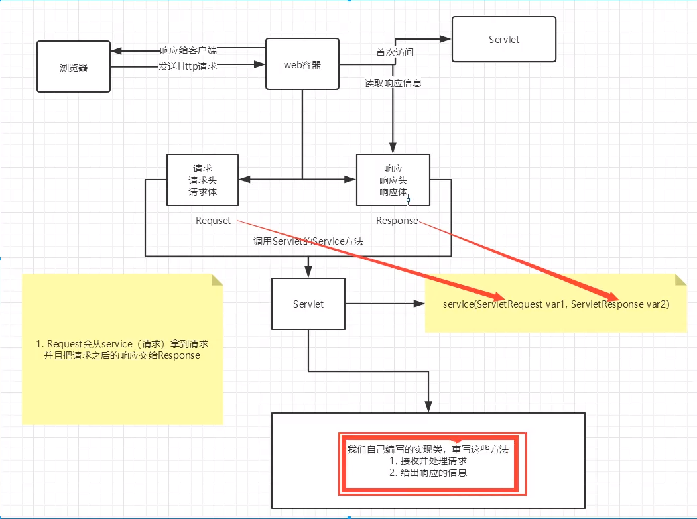

## JavaWeb

### 1. 基本概念

web开发

- web 网页的意思

- 静态web

  - html，css
  - 提供给所有人看的数据始终不会发生变化

- 动态web

  - 提供给所有人看的数据始终会发生变化，每个人在不同时间，不同的地点看到的信息各不相同
  - 技术栈：Servlet/JSP，ASP，PHP

  在java中，动态web资源开发的技术统称为javaweb

  

### 1.2 web应用程序

web应用程序：可以提供浏览器访问的程序：

- a.html、b.html......多个web资源，这些web资源可以被外界访问，对外界提供服务
- 能访问到的任何一个页面或者资源，都存在于这个世界的某一个角落的计算机上
- URL
- 这个统一的web资源会被放在同一个文件夹下，web应用程序->Tomcat：服务器
- 一个web应用由多部份组成（静态web，动态web）
  - html，css，js
  - jsp，servlet
  - java程序
  - jar包
  - 配置文件（Properties）

we应用程序编写完毕后，若想提供给外界访问：需要一个服务器来统一管理

### 1.3 静态web

- *.html这些都是网页的后缀，如果服务器上一直存在这些东西，我们就可以直接进行读取。


- 静态web存在的缺点
  - web页面无法动态更新，所有用户看到的都是同一个页面
    - 轮播图，点击特效：伪动态
    - JavaScript
    - VBScript
  - 它无他和数据库交互（数据无法持久化，用户无法交互）

### 1.4 动态web

页面会动态显示：“web页面展示的效果因人而异”


缺点：

- 假如服务器的动态web资源出现了错误，我们需要重新编写我们的**后台程序**，重新发布
  - 停机维护

优点：

- web页面无法动态更新，所有用户看到的都不是同一个页面
- 它可以和数据库交互（数据持久化：注册，商品信息，用户信息）


## 2.web服务器

### 2.1 技术

ASP

- 微软：国内最早流行的就是ASP
- 在HTML中嵌入了VB的脚本，ASP+COM
- 在ASP开发中，基本一个页面都有几千行的业务代码，页面极其混乱
- 维护成本高
- C#
- IIS

PHP

- PHP开发速度很快，功能很强大，跨平台，代码简单（70%，WP）
- 无法承载大访问量的情况（局限性）

JSP/Servlet

B/S：浏览器和服务器

C/S：客户端和服务器

- sun公司主推的B/S架构
- 基于java语言的（所有的大公司，或者一些开源的组件，都是用java写的）
- 可以承载三高（高并发，高可用，高性能）问题带来的影响
- 语法想ASP，ASP->JSP，加强市场强度

......

### 2.2 web服务器

服务器是一种被动的操作，用来处理用户的一些请求和给用户的一些相应信息

**IIS**

微软的：ASP，Windows中自带的

**Tomcat**

面向百度编程

工作3-5年，可以尝试手写Tomcat服务器

## 3. Tomcat

### 3.1 安装Tomcat

### 3.2 Tomcat启动和配置

文件夹信息


**启动，关闭Tomcat**

访问测试：http://localhost:8080/

可能遇到的问题：

1. Java环境变量没有配置
2. 闪退问题：需要配置兼容性
3. 乱码问题：配置文件中设置

### 3.3 配置

Tomcat的conf目录下的server.xml文件可以配置：

- 启动的端口号
  - Tomcat的默认端口号为：8080
  - mysql：3306
  - http：80
  - https：443

```xml
<Connector port="8081" protocol="HTTP/1.1"
           connectionTimeout="20000"
           redirectPort="8443" />
```


- 可以配置主机名称
  - 默认的主机名为：localhost->127.0.0.1
  - 默认的网站应用存放的位置为：webapps

```xml
<Host name="www.daisy.com" appBase="webapps"
      unpackWARs="true" autoDepoly="true" />
```

服务器在访问域名时会先查看C:\Windows\System32/driver/etc\hosts文件的映射关系，然后再去dns服务商转换

**高难度面试题：**

请你谈谈网络是如何进行访问的

1. 输入一个域名：回车

2. 检查本机的C:\Windows\System32/driver/etc\hosts配置文件下有没有这个域名映射：

   1. 有：直接返回对应的ip地址：这个地址中有我们需要访问的web程序，可以直接访问

   ```java
   127.0.0.1			www.daisy.com
   ```

   ​	2.没有：去DNS（domain name service）服务器找，找到的话就返回，找不到就返回找不到


### 3.4 发布一个web网站

不会就先模仿

- 将自己写的网站，放到服务器（Tomcat）中指定的web应用的文件夹（webapps）下，就可以访问了

网站应该有的结构

```java
--webapps : Tomcat服务器的web目录
    -ROOT
    -daisystudy : 网站的目录名
        - WEB-INF
        	-classes : java程序
            -lib : web应用所依赖的jar包
            -web.xml
        - index.html 默认的首页
        - static
                -css
                	-style.css
                -js
                -img
        - ......
```

## 4. Http

### 4.1 什么是HTTP

http（超文本传输协议）是一个简单的请求-响应协议，它通常运行在TCP之上。

- 文本：html，字符串，...
- 超文本：图片，音乐，视频，定位，地图
- 80

Https：安全的

- 443

### 4.2 两个时代

- http 1.0
  - HTTP/1.0：客户端可以与web服务器连接，只能获得一个web资源，断开连接
- http 2.0
  - HTTP/1.1：客户端可以与web服务器连接，可以获得多个web资源。

### 4.3 Http请求

- 客户端--发请求（Request）--服务器

百度：

```java
Request URL: https://www.baidu.com/		请求地址
Request Method: GET					get方法/post方法
Status Code: 200 OK					状态码：200
Remote(远程) Address: 61.135.169.121:443	
```

```java
Accept:text/html
Accept-Encoding: gzip, deflate, br
Accept-Language: zh-CN,zh;q=0.9		语言
Cache-Control:max-age=0
Connection: keep-alive
```

#### 1. 请求行
   - 请求行中的请求方式：GET
   - 请求方式：Get，Post，HEAD，DELETE，PUT，TRACT
     - get：请求能够携带的参数比较少，大小有限制，会在浏览器的URL地址栏显示数据内容，不安全，但高效
     - post：请求能够携带的参数大小没有限制，不会在浏览器的URL地址栏显示数据内容，安全，但不高效
#### 2. 请求头

```java
Accept:告诉浏览器，它所支持的数据类型
Accept-Encoding:支持那种编码格式	GBK	UTF-8	GB2312	ISO8859-1
Accept-Language:告诉浏览器，他的语言环境
Cache-Control：缓存控制
Connection:告诉浏览器，请求完成时断开还是保持连接
HOST:主机.../
```


### 4.4 Http响应

- 服务器--相应--客户端

百度

```java
Cache-Control: private			缓存控制
Connection: keep-alive			连接
Content-Encoding: gzip			编码
Content-Type: text/html;charset=utf-8	类型
```

#### 1. 响应体

```java
Accept:告诉浏览器，它所支持的数据类型
Accept-Encoding:支持那种编码格式	GBK	UTF-8	GB2312	ISO8859-1
Accept-Language:告诉浏览器，他的语言环境
Cache-Control：缓存控制
Connection:告诉浏览器，请求完成时断开还是保持连接
HOST:主机.../
Refresh:告诉客户端，多久刷新一次
Location:让网页重新定位
```


#### 2. 响应状态码

200：请求相应成功

3XX：请求重定向

- 重定向：你重新到我给你新位置去

4XX：找不到资源 404

- 资源不存在

5XX：服务器代码错误 500 502（网关错误）

**常见面试题：**

当你的浏览器中地址栏输入地址并回车的一瞬间到页面能够展示回来，经历了什么？

### 5. Maven 

 ==因为这部分之前整理过，所以就大致记录了框架==

为什么要学这个技术？

1. 在Javaweb开发中，需要使用大量手动导入的jar包
2. 如何让一个东西自动导入和配置这个jar包
3. 由此，Maven诞生了

#### 5.1 Maven项目架构管理工具

我们目前用来就是方便导入jar包的

Maven的核心思想：**约定大于配置**

Maven会规定好该如何编写我们的java代码，必须按照这个规范来

#### 5.2 下载maven

#### 5.3 配置环境变量

### 5.4 阿里云镜像

### 5.5 本地仓库

### 5.6 在idea中使用maven

### 5.7 创建一个普通的Maven项目

### 5.8 标记文件目录

### 5.9 在maven中配置tomcat

### 5.10  pom.xml配置

Maven的强大之处在于，他会帮你导入这个jar包所依赖的其他jar

maven由于他的约定大于配置，我们之后可能遇到写的配置文件无法被导出或者生效问题，解决方案如下

参考博客 -> [maven资源文件的相关配置](https://www.cnblogs.com/pixy/p/4798089.html)

```java
<build>
      <resources>
        <resource>
            <directory>src/main/resources</directory>
            <excludes>
                <exclude>**/*.properties</exclude>
                <exclude>**/*.xml</exclude>
             </excludes>
            <filtering>false</filtering>
        </resource>
        <resource>
            <directory>src/main/java</directory>
            <includes>
                <include>**/*.properties</include>
                <include>**/*.xml</include>
            </includes>
            <filtering>false</filtering>
        </resource>
    </resources>
</build>
```

### 5.13 解决遇到的问题

idea中web.xml与tomcat一致

```Java
<?xml version="1.0" encoding="UTF-8"?>

<web-app xmlns="http://xmlns.jcp.org/xml/ns/javaee"
         xmlns:xsi="http://www.w3.org/2001/XMLSchema-instance"
         xsi:schemaLocation="http://xmlns.jcp.org/xml/ns/javaee
                      http://xmlns.jcp.org/xml/ns/javaee/web-app_4_0.xsd"
         version="4.0"
         metadata-complete="true">

</web-app>
```

## 6. Servlet

### 6.1 Servlet简介

Servlet接口在sun公司有两个默认的实现类：HttpServlet

- Servlet是sun公司开发动态web的一门技术
- sun公司在这些API中提供了一个接口叫做Servlet，如果想开发一个Servlet程序，只需要完成两个小步骤
  - 编写一个类，实现servlet接口
  - 把开发好的Java类部署到web服务器中

**把实现了Servlet接口的Java程序叫做Servlet**

### 6.2 HelloServlet

1. 构建一个普通的Maven项目，删掉里面的src目录，这个空的工程就是Maven主工程

2. 关于Maven父子工程的理解：

   父项目中会有

   ```xml
       <modules>
           <module>servlet-01</module>
       </modules>
   ```

   

   子项目中会有（我的没有，所以是自己加上的）

   ```xml
     <parent>
       <artifactId>JavaWebStudy</artifactId>
       <groupId>com.daisy</groupId>
       <version>1.0-SNAPSHOT</version>
     </parent>
   ```

   父项目中的Java子项目可以直接使用

   ```java
   son extends father
   ```

   

3. Maven环境优化

   1. 修改web.xml为最新的
   2. 将maven结构搭建完整

4. 编写一个servlet程序

   1. 编写一个普通类
   2. 实现servlet接口，这里直接继承HttpServlet

5. 编写Servlet的映射

   为什么需要映射：写的是Java程序，但是需要浏览器访问，而浏览器需要连接web服务器，所以我们需要在web服务器中注册Servlet，还需要给他一个浏览器能供访问的路径

6. 配置Tomcat

7. 启动测试

### 6.3 Servlet原理

Servlet是由web服务器调用



### 6.4 mappering

1. 一个Servlet可以指定一个映射路径

2. 一个Servlet可以指定多个映射路径

3. 一个Servlet可以指定通用映射路径

4. 默认请求路径(直接覆盖主页)

   ```xml
       <servlet-mapping>
           <servlet-name>hello</servlet-name>
           <url-pattern>/*</url-pattern>
       </servlet-mapping>
   ```

5. 指定一些后缀或者前缀等等......

   ```xml
       <!--
   		可以自定义后缀实现请求映射
   		*前面不能加映射的路径 如/*，/hello/*.daisy
   	-->
   	<servlet-mapping>
           <servlet-name>hello</servlet-name>
           <url-pattern>*.daisy</url-pattern>
       </servlet-mapping>
   ```

6. 优先级问题

   指定了固有的映射路径优先级最高，如果找不到就会走默认的处理请求

### 6.5 ServletContext

web容器在启动的时候，它会为每个web程序都创建一个对应的ServletContext对象，它代表了当前的web应用

- 共享数据

  在这个Servlet中的数据可以在另一个Servlet中访问到

- 获取初始化参数

- 请求转发

- 读取资源文件

  - 在java目录下新建properties

  - 在resources目录下新建properties

    发现：都被打包到了同一路径下，classes，俗称这个路径为classpath


### 6.6 HttpServletResponse

web服务器接收到客户端的http请求，针对这个请求，分别创建一个代表请求的HttpServletRequest对象，代表相应的一个HttpServletResponse：

- 如果要获取客户端请求过来的参数：找HttpServletRequest
- 如果要给客户端相应一些信息：找HttpServletResponse

**常见应用**

1. 向浏览器输出消息
2. 下载文件
   1. 要获取下载文件的路径
   2. 下载的文件名
   3. 设置想办法让浏览器能够支持下载需要的东西
   4. 获取下载文件的输入流
   5. 创建缓冲区
   6. 获取OutputStream对象
   7. 将FileOutputStream流写入到buffer缓冲区
   8. 使用OutputStream将缓冲区中的数据输出到客户端

```java
    @Override
    protected void doGet(HttpServletRequest req, HttpServletResponse resp) throws ServletException, IOException {
//        1. 要获取下载文件的路径
        String realPath = "D:\\IdeaProjects\\JavaWebStudy\\response\\target\\classes\\啦啦.png";
//        String realPath = this.getServletContext().getClassLoader().getResource("/啦啦.png");
//        String realPath = this.getServletContext().getRealPath("/啦啦.png");
        System.out.println("要下载的文件位置" + realPath);
//        2. 下载的文件名
        String fileName = realPath.substring(realPath.lastIndexOf("\\")+1);
//        3. 设置想办法让浏览器能够支持(Content-Disposition)下载需要的东西(搜索"web下载文件的头信息")
        resp.setHeader("Content-disposition","attachment;filename="+ URLEncoder.encode(fileName,"UTF-8"));
//        4. 获取下载文件的输入流
        FileInputStream in = new FileInputStream(realPath);
//        5. 创建缓冲区
        int len = 0;
        byte[] buffer = new byte[1024];
//        6. 获取OutputStream对象
        ServletOutputStream out = resp.getOutputStream();
//        7. 将FileOutputStream流写入到buffer缓冲区,使用OutputStream将缓冲区中的数据输出到客户端
        while((len = in.read(buffer)) > 0){
            out.write(buffer,0,len);
        }
        in.close();
        out.close();

    }
```

3. 验证码功能

   验证码怎么来的？

   - 前端实现
   - 后端实现，需要用Java的图片类，生成一个图片

```java
    @Override
    protected void doGet(HttpServletRequest req, HttpServletResponse resp) throws ServletException, IOException {
//        如何让浏览器5秒自动刷新一次
        resp.setHeader("refresh","3");
//        在内存中创建一个图片
        BufferedImage image = new BufferedImage(80,20,BufferedImage.TYPE_INT_RGB);
//        得到图片
        Graphics2D g = (Graphics2D) image.getGraphics();//笔
//        设置图片的背景颜色
        g.setColor(Color.WHITE);
        g.fillRect(0,0,80,20);
//        给图片写数据
        g.setColor(Color.blue);
        g.setFont(new Font(null,Font.BOLD,20));
        g.drawString(makeNum(),0,20);

        //告诉浏览器，这个请求用图片的方式打开
        resp.setContentType("image/jpeg");
        //网站存在缓存，不让浏览器缓存
        resp.setDateHeader("expires",-1);
        resp.setHeader("Cache-Control","no-cache");
        resp.setHeader("Pragma","no-cache");

        //把图片写给浏览器
        boolean write = ImageIO.write(image,"jpg",resp.getOutputStream());
    }

    //生成随机数
    private String makeNum(){
        Random random = new Random();
        String num = random.nextInt(9999999)+"";
        StringBuffer sb = new StringBuffer();
        for(int i = 0; i < 7-num.length(); i++){
            sb.append("0");
        }
        return sb.toString() + num;
    }
```


4. 实现重定向

一个web资源收到客户端请求后，会通知客户端去访问另一个web资源C，这个过程叫做重定向

常见场景：

- 用户登录

面试题：重定向和转发的区别

相同点：

- 页面都会实现跳转

不同点：

- 请求转发时，url不会发生变化：307
- 重定向时，url地址栏会发生变化：302

4. 

### 6.7 HttpServletRequest

HttpServletRequest代表客户端的请求，用户通过Http协议访问服务器，HTTP请求中的所有信息被封装到HttpServletRequest，通过这个HttpServletRequest的方法，获得客户端的所有信息

获取前端传递的参数，请求转发

## 7. Cookie Session

### 7.1 会话

**会话**：用户打开一个浏览器，点击了很多超链接，访问多个web资源，关闭浏览器，这个过程称为会话

**有状态会话**：一个学生来过教室，下次再来教室，我们会知道这个同学曾经来过，称之为有状态会话

怎么证明你是学生？

1. 发票				学校给你发票
2. 学校登记         学校标记你来过了

**一个网站怎么证明来过**

1. 服务端给客户端一个信件，客户端下次访问服务器带上信件就可以了；cookie
2. 服务器等级你来过了，下次你来的时候我来匹配你；session

### 7.3 保存会话的两种技术

**cookie**

- 客户端技术（相应，请求）

**session**

- 服务器技术，利用这个技术，可以保存用户的会话信息，我们可以把信息或者数据放在Session中

常见例子：网站登录之后，下次不用登陆了，第二次访问直接登录

### 7.3 cookie

1. 从请求中拿到cookie信息
2. 服务器响应给客户端cookie

```java
Cookie[] cookies = req.getCookies();
cookie.getName();	//获得cookie中的key
cookie.getValue();	//获得cookie中的value
new Cookie("lastLoginTime",System.currentTimeMillis()+"");//新建一个cookie
cookie.setMaxAge(24*60*60);	//设置cookie的有效期
resp.addCookie(cookie);	//响应客户端一个cookie
```

**cookie一般会保存在本地的用户目录下appdata**

- 一个Cookie只能保存一个信息；
- 一个web站点可以给浏览器发送多个Cookie，最多存放20个Cookie；
- Cookie大小由限制4kb；
- 300个Cookie为浏览器上限；

删除Cookie

- 不设置有效期，关闭浏览器，自动失效；
- 设置有效期时间为0；

**解决乱码问题**

```java
//也不知道为什么老师那个utf-8没有乱码，但是我这里就是乱码，改成utf-16才好用
req.setCharacterEncoding("utf-16");
resp.setCharacterEncoding("utf-16");
        resp.setContentType("text/html;charset=utf-8");
```

**编码解码**

```java
URLEncoder.encode("阿幡","utf-8");
URLDecoder.decode(cookie.getValue(),"utf-8")
```

### 7.4 Session(重点)

- 服务器会给每个用户（浏览器）创建一个Session对象
- 一个Session独占一个浏览器，只要浏览器没有关闭，这个Session就存在
- 用户登录之后，整个网站它都可以访问->保存用户的信息，保存购物车的信息

Session和Cookie的区别

- Cookie是吧用户的数据写给用户的浏览器，浏览器保存（可以保存多个）
- Session是把用户的数据写到用户独占Session中，服务器端保存（保存重要信息，减少服务器资源的浪费）
- Session对象由服务器创建

使用场景

- 保存一个登录用户的信息
- 购物车信息
- 在整个网站中经常会使用的数据，将他保存在Session中

**会话自动过期，需要在web.xml中配置**

## 8. JSP

## 8.1 什么是JSP

Java Server Page：Java服务器端页面，也和Servlet一样，用于动态Web技术

最大的特点：

- 写JSP就像在写HTML
- 区别：
  - HTML只给用户提供静态的数据
  - JSP页面中可以嵌入JAVA代码，为用户提供动态数据

### 8.2 JSP原理

思路：JSP到底怎么执行的

- 代码层面没有任何问题

- 服务器内部工作

  Tomcat中有一个work目录

  IDEA中使用Tomcat的会在IDEA中生成一个work目录

JSP源码的位置（好像不同的电脑打开的位置可能不同，大家可以用搜索来找，会方便一些）

`C:\Users\lenovo\AppData\Local\JetBrains\IntelliJIdea2020.2\tomcat\Unnamed_JavaWebStudy\work\Catalina\localhost\cookie_war_exploded\org\apache\jsp`

**浏览器像服务器发送请求，不管访问什么资源，都是在访问Servlet**

JSP最终也会被转换成为一个Java类

在JSP页面中：

只要是Java代码就会原封不动的输出

如果是HTML代码就会被转换成

```java
out.write("<html>\r\n");
```

这样的格式，输出到前端

### 8.3JSP基础语法

JSP作为Java技术的一种应用，它拥有一些自己扩充的语法，java的所有语法都支持

**JSP表达式**

```jsp
<%= xx%>
```


**JSP脚本片段**

```jsp
<%
	int sum = 10;
	sum = sum + 10;
%>
```


**JSP声明**

```jsp
<%!
    static{
    	System.out.println("Loading Servlet!");
	}
	private int globalvar = 0;
	public void daisy(){
        System.out.println("进入了方法daisy");
    }
%>
```

JSP声明：会被编译到JSP生成的Java类中，其他的就会被生成到Service方法中

在JSP中嵌入代码即可

JSP的注释，不会在客户端显示，HTML的会

### 8.4 JSP指令

```jsp
<%@page args... %>
<%@include file=""%>

<%--将两个页面合二为一--%>
<%@include file="common/head.jsp" %>
<h5>网页主体</h5>
<%@include file="common/footer.jsp" %>

<hr>
<%--jsp:include 拼接页面，本质还是三个--%>
<jsp:include page="common/head.jsp"/>
<jsp:include page="common/footer.jsp" />
</body>
```

### 8.5 JSP九大内置对象

- PageContext		存东西
- Request                存东西
- Response
- Session 存东西
- Application [ServletContext] 存东西
- config [ServletConfig]
- out
- page，不用了解
- exception

```java
pageContext.setAttribute("name1","啦啦啦1");//保存的数据只在一个页面中有效
request.setAttribute("name2","啦啦啦2");//保存的数据旨在一次请求中有效，请求转发会携带这个数据
session.setAttribute("name3","啦啦啦3");//保存的数据只在一次会话中存放，从打开浏览器到关闭浏览器
application.setAttribute("name4","啦啦啦4");//保存的数据只在服务器中有效，从打开服务器到关闭服务器
```

request：客户端向服务器发送请求，产生的数据，用户看完就没用了，比如：新闻，用户看完没用的

session：客户端向服务器发送请求，产生的数据，用户看完一会还有用，比如：购物车，（Hystrix）

application：客户端向服务器发送请求，产生的数据，一个用户用完了，其他用户还可能使用，比如：聊天数据

### 8.6 JSP标签，JSTL标签，EL表达式

EL表达式：${}

- 获取数据
- 执行运算
- web开发的常用对象 

**JSP标签**

```java
<jsp:forward page="/jsptag2.jsp">
    <jsp:param name="name" value="test"/>
</jsp:forward>
```

**JSTL表达式**

JSTL标签库的使用是为了弥补HTML标签的不足；它自定义许多标签。

**核心标签**

**JSTL标签库使用步骤**

- 引用对应的taglib
- 使用其中的方法

```java
<form action="core.jsp" method="get">
    <input type="text" name="username" value="${param.username}">
    <input type="submit" value="登录">
</form>
<c:if test="${param.username == 'admin'}" var="isAdmin">
    <h2>登录成功</h2>
    <c:out value="管理员欢迎您"></c:out>
</c:if>

<c:choose>
    <c:when test=""></c:when>
</c:choose>

<c:out value="${isAdmin}"></c:out>

<%
    ArrayList<String> people = new ArrayList<>();
    people.add("张三");
    people.add("李四");
    people.add("王五");
    people.add("test");
    people.add("daisy");

    request.setAttribute("list", people);
%>
<br>
<hr>
<%--
    var:每一次遍历出来的变量
    items:要遍历的对象
    begin:
    end:
    step:步长
--%>
<c:forEach var="people" items="${list}">
    <c:out value="${people}" ></c:out> <br>
</c:forEach>


<hr>
<br>
<c:forEach items="${list}" var="people" begin="0" step="2">
    <c:out value="${people}"></c:out> <br>
</c:forEach>
```

## 9. JavaBean

实体类

JavaBean有特定的写法：

- 必须要有一个无参构造
- 属性必须私有化
- 必须有对应的get/set方法

一般用来和数据的字段做映射ORM

ORM：对象关系映射

- 表->类
- 字段->属性
- 行记录->对象

## 10. MVC三层架构

什么是MVC：Model view Controller 模型、视图、控制器

### 10.1 早些年


用户直接访问控制层，控制层直接操作数据库

```java
	servlet->CRUD->数据库
    弊端：程序十分臃肿，不利于维护
    servlet的代码中：处理请求，响应试图跳转，处理JDBC，处理业务代码，处理逻辑代码
    
    架构：没有什么事加一层解决不了的
    程序员调用
    |
    JDBC
    |
    Mysql Oracle sqlServer
```

### 10.2 MVC三层架构


Model

- 业务处理：业务逻辑（Service）
- 数据持久层：CRUD（Dao）

View

- 展示数据
- 提供链接发起Servlet请求（a，form，img...）

Controller

- 接收用户的请求：（req：请求参数，session信息）
- 交给业务层处理响应的代码
- 控制视图的跳转

```java
登录->接收用户的登录请求->处理用户的请求（获取用户登录的参数：username，password）->给业务层处理登录业务（判断用户名密码是否正确）->Dao层查询用户名和密码是否正确->数据库

```

## 11. Filter

Filter：过滤器，用来过滤网站的数据

- 处理中文乱码
- 登陆验证

步骤

1. 导包

2. 编写过滤器

   1. 导包不要导错

   2. 实现filter接口，重写对应的方法

    ```java
          @Override
          public void doFilter(ServletRequest servletRequest, ServletResponse servletResponse, FilterChain filterChain) throws IOException, ServletException {
              System.out.println("dofilter");
              servletRequest.setCharacterEncoding("utf-16");
              servletResponse.setCharacterEncoding("utf-16");
      
              System.out.println("执行前");
              filterChain.doFilter(servletRequest,servletResponse);
              System.out.println("执行后");
          }
    ```

   3. 在web.xml中配置filter
   ```xml
       <filter>
           <filter-name>CharacterEncodingFilter</filter-name>
           <filter-class>com.daisy.filter.CharacterEncodingFilter</filter-class>
       </filter>
       <filter-mapping>
           <filter-name>CharacterEncodingFilter</filter-name>
           <url-pattern>/*</url-pattern>
       </filter-mapping>
   ```

## 12. 监听器

实现一个监听器的接口：（有N种）

## 13. 过滤器、监听器常见应用

## 14. JDBC 

需要jar包的支持

- java.sql
- javax.sql
- mysql-connecter-java...连接驱动

**JDBC固定步骤**

1. 加载驱动
2. 连接数据库
3. 向数据库发送SQL的对象Statement：CRUD
4. 编写SQL（根据业务，不同的SQL）
5. 执行SQL
6. 关闭连接

**事务**

要么都成功，要么都失败！

ACID原则：保证数据的安全

```java
开启事务
事务提交	commit()
事务回滚	rollback()
关闭事务
```

**Junit单元测试**

依赖

```sh
<!--单元测试-->
<dependency>
	<groupId>junit</groupId>
	<artifactId>junit</artifactId>
	<version>4.12</version>
</dependency>
```

简单实用

@Test注解只有在方法上有效，只要加了这个注解的方法，就可以直接运行！测试成功时是绿色，测试失败时是红色。


参考博客

[idea maven工程保证JDK版本不变](https://www.cnblogs.com/crowsong/p/6688449.html)