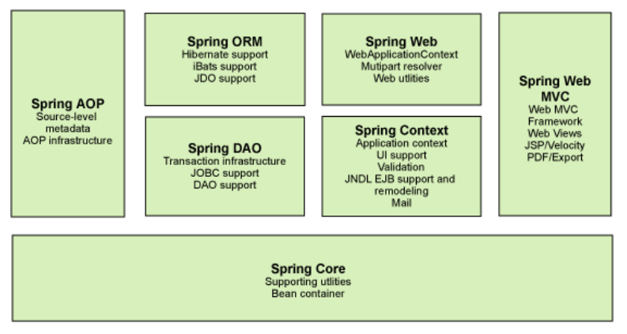

## Spring

### 1.1 简介

- Spring：春天->给软件行业带来了春天
- 2002年，首次推出了Spring框架的雏形：interface21框架
- Spring框架即以interface21框架为基础，经过重新设计，并不断丰富其内涵，于2004年3月24日，发布了1.0正式版
- **Rod Johnson**，Spring Framework创始人
- spring理念：使现有的技术更加容易使用，本身是一个大杂烩，整合了现有的技术框架


- SSH：Struct2+Spring+Hibernate
- SSM：SpringMVC+Spring+Mybatis

[官网](https://spring.io/)

[官方下载地址](https://repo.spring.io/release/org/springframework/spring)

[GitHub地址](https://github.com/spring-projects/spring-framework)


```xml
<!-- https://mvnrepository.com/artifact/org.springframework/spring-webmvc -->
<dependency>
    <groupId>org.springframework</groupId>
    <artifactId>spring-webmvc</artifactId>
    <version>5.2.9.RELEASE</version>
</dependency>
<dependency>
    <groupId>org.springframework</groupId>
    <artifactId>spring-jdbc</artifactId>
    <version>5.2.9.RELEASE</version>
</dependency>

```


### 1.2 优点

- Spring是一个开源的免费的框架（容器）
- Spring是一个轻量级的、非入侵式的框架
- 控制反转（IoC）、面向切面变成（AOP）
- 支持事务的处理，对框架整合的支持

==总结：Spring就是一个轻量级的控制反转和面向切面编程的框架==


### 1.3 Spring的组成



[Spring 七大核心模块](https://www.cnblogs.com/qlqwjy/p/9071510.html)


### 1.4拓展

现代化的Java开发，说白了就是基于Spring的开发

- Spring Boot
  - 一个快速开发的脚手架
  - 基于SpringBoot可以快速开发单个微服务
  - 约定大于配置
- Spring Cloud
  - SpringCloud是基于SpringBoot实现的

现在大多数公司都在使用SpringBoot进行快速开发，学习SpringBoot的前提，需要完全掌握Spring及SpringMVC，承上启下的作用

弊端：发展了太久之后，违背了原来的理念，配置十分繁琐，人称：“配置地狱”


## IoC理论推导

1. UserDao 接口
2. UserDaoImpl 实现类
3. UserService 业务接口
4. UserServiceImpl 业务实现类

在之前的业务中，用户的需求可能会影响我们原来的代码，我们需要根据永不的需求去修改源代码，如果程序代码量十分大，修改一次的成本代价非常昂贵

```java
    private UserDao userdao;

    public void setUserdao(UserDao userdao) {
        this.userdao = userdao;
    }
```


- 之前，程序是主动创建对象，控制权在程序员手上
- 使用了set注入后，程序不再具有主动性，而是变成了被动的接受对象

这种思想，从本质上解决了问题，程序员不用去管理对象的创建，系统的耦合性大大降低，可以更加专注的再业务的实现上。这是IoC的原型

### IoC本质

**控制反转是一种设计思想，DI是实现IoC的一种方法**

没有IoC的程序中，我们使用面向对象变成，对象的创建与对象间的依赖关系完全硬编码在程序中，对象的创建由程序自己控制，控制反转后将对象的创建转移给第三方。

所谓的控制反转是：获得依赖对象的方式反转了。

采用XML方式配置Bean的时候，Bean的定义信息是和实现分离的，而采用注解的方式可以把两者合二为一，Bean的定义信息直接以注解的形式定义在实现类中，从而达到了零配置的目的

**控制反转是一种通过描述（XML或注释）并通过第三方去生产和获取特定对象的方式，在Spring中实现控制反转的是IoC容器，其实现方法是依赖注入**

## IoC创建对象的方式

1. 使用无参构造创建对象，默认

2. 假设我们要使用有参构造来创建对象

   1. 下标赋值

      ```xml
      <!--    第一种，下标赋值-->
      <bean id="user" class="com.niko.pojo.User">
          <constructor-arg index="0" value="niko啦啦啦"></constructor-arg>
      </bean>
      ```

   2. 类型

      ```xml
      <!--    第二种方式，通过类型创建，不建议使用-->
      <bean id="user" class="com.niko.pojo.User">
          <constructor-arg type="java.lang.String" value="阿幡"></constructor-arg>
      </bean>
      ```

      

   3. 参数名

      ```xml
      <!--直接通过参数名来设置-->
      <bean id="user" class="com.niko.pojo.User">
          <constructor-arg name="name" value="啦啦啦"></constructor-arg>
      </bean>
      ```

      

总结：在配置文件加载的时候，容器中管理的对象就已经初始化了


