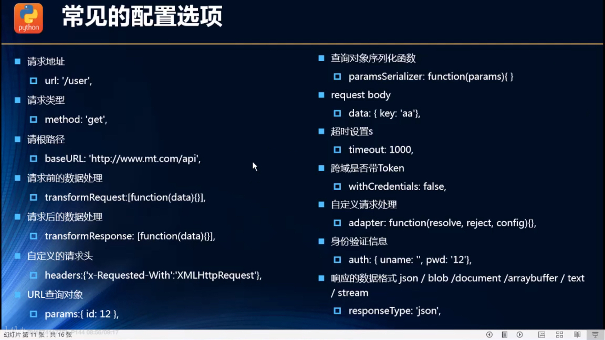

# axios

## 什么是axios

axios是一个开源的可以用在浏览器端的和nodejs的异步通信框架，它的主要作用就是实现ajax异步通信，其功能特点如下

- 从浏览器中创建`XMLHttpRequests`
- 从`node.js`创建`http`请求
- 支持`Promise API`
- 拦截请求和响应
- 转换请求数据和相应数据
- 取消请求
- 自动转换`JSON`数据
- 客户端支持防御`XSRF`（跨站请求伪造）

## axios的使用

### 安装vue axios

```she
npm install --save axios vue-axios
```

### 2. 在main.js中使用

```js
import Vue from 'vue'
import axios from 'axios'
import VueAxios from 'vue-axios'

Vue.use(VueAxios, axios)
```

### 3. 发送ajax请求

```js
this.axios({
    method:'get',
    url:'http://...',
    data:{}
}).then(function (response){
    console.log(response.data);
})
```


可测试接口：[httpbin](http://httpbin.org/)

## axios的基本使用

```javascript
// axios基本使用
axios({
  url: 'xxx',
  methods: 'get'
}).then(res => {
  console.log(res);
})

axios({
  url: '/home/data',
  //对应一个对象类型，自动对其进行拼接，针对get请求的参数拼接
  params: { 
    type: 'pop',
    page: 1
  }
}).then(res => {
  console.log(res);
})
```

==jsonp的使用==


## axios发送并发请求

`axios([axios(),axios()]).then(axios.spread(res1, res2)=>{})`

使用`axios.all`可以放入多个请求的数组

`axios.all([])`返回的结果是一个数组，使用`axios.spread`可将数组`[res1,res2]`展开为`res1,res2`(使用了数组解构)                                                                                                                                                                                                                                                                                                                                                                                                                                                                                                                                                                                                                                                                                                                                                                                                                                                                                                                                                                                                                                                                                                                                                                                                                                                                                                                                                                                                                                                                                                                                                                                                                                                                                                                                                                                                                                                                                                                                                                                                                                                                                                                                                                                                                                                                                                                                                                                                                                                                                                                                                                                                                                                                                                                                                                                                                                                                                                                                                                                                                                                                                                       )

```javascript
axios.all([
  axios({
    url: '/home/multidata'
  }), 
  axios({
    url: '/home/data',
    params: {
      type: 'pop',
      page: 5
    }
  })]).then(axios.spread((res1,res2) => {
    console.log(res1);
    console.log(res2);
}))
```


## 使用全局的axios和对应的配置在进行网络请求

```javascript
axios.defaults.baseURL = '要使用的地址'
axios.defaults.timeout = 5000 // 设置超时时间
```




## axios的实例

当我们从axios模块中导入对象的时候，使用的实例是默认的实例，当给该对象设置一些默认配置时，这些配置就被固定下来了，但是后续开发中，某些配置可能不太一样。这个是扣可以创建新的实例，并且传入属于该实例的配置信息

```javascript
const instance1 = axios.create({
  baseURL: '',
  timeout: 5000
})

instance1({
  url: '/home/multidata'
}).then(res => {
  console.log(res)
})

instance1({
  url: '/home/data',
  params: {
    type: 'pop',
    page: 1
  }
}).then(res => {
  console.log(res)
})

```


## axios的封装

```javascript
export function request(config) {
  // 创建axios的示例
  const instance = axios.create({
    baseURL: 'http://152.136.185.210:8000/api/z8',
    timeout: 5000
  })

  // axios的拦截器
  instance.interceptors.request.use(config => { 
    console.log(config)
    // 比如说config中的某些信息不符合服务器要求
    // 比如每次发送网络请求时，都希望再界面时显示一个请求的图标
    // 某些网络请求，比如登录，必须携带一些特殊的信息
    return config;
  }, err => { 
    console.log(err);
  });

  // 响应拦截
  instance.interceptors.response.use(res => {
    // console.log(res);
    return res.data
  }, err =>{
    console.log(err);
  });
  // 发送真正的网络请求
  return instance(config);
}

```


## axios拦截器

请求，响应的成功和失败拦截


