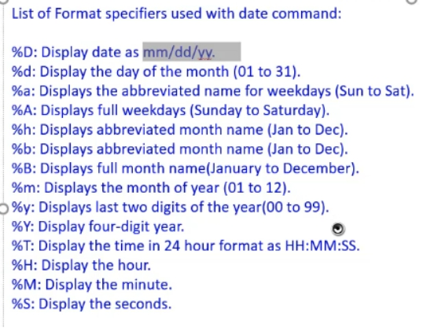
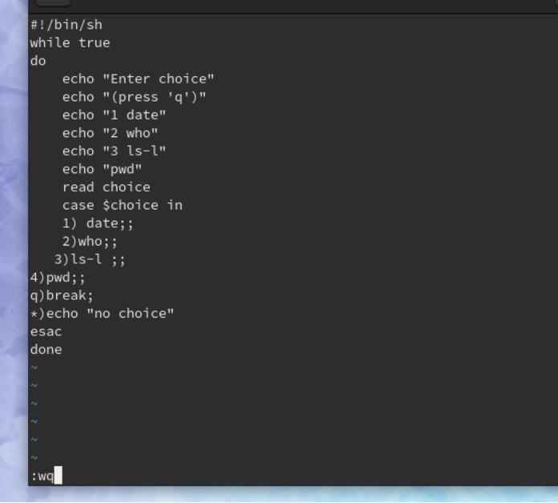

### 编辑框设置

```shell
date 输出当前时间
clear 清除
tput clear 清屏
tput cup 15 20  也就是让初始位置变成15 20
tput reset 返回上一步
tput blink 使下一行闪烁显示
tput smso 启动突出模式
tput rmso 停止突出模式
```


### date函数用法

```shel
data  输出系统标准时间
data  -u  输出格里尼治时间（注意要空格空格）
date  --date=”1 year  ago”  返回一年前的时间
date  --date=”2 year  ago”  返回2年前的时间
同样的写法对month  day  hour  min 通用，注意这些名词后面都不加s
date  --date=”yesterday” 返回一天前的时间
date  --date=”1 year  ”  返回一年后的时间
其余用法同6
cd Desktop  进入Desktop文件夹 注意大小写不能错
pwd  输出当前所在的文件路径
ls  输出当前文件下的所有文件
ls  -l  输出文件的具体参数
Date  -r niit.txt  查询niit.txt的操作时间
用法 date  “+%d”
Date  “%Y : %m : %d”
```



info与man的用途差点儿相同，info page是将文件数据拆成一个个的段落，每一个段落有个独立的页面，相当于一个独立的节点，每一个节点都有定位于链接。


### 创建文件
```shell
pwd 意思是显示当前所在文件路径
ls  -l 意思是返回所有文件的路径详情展示
cd  意思是进入所示文件路径

创建一个txt文件：
   输入vi +文件名
   输入txt文件中的文字
   按下esc
   输入   :wq   保存并推出
cat +文件名  查看这个文件里写的东西
mv  a  b   讲a移动到b位置
如果目标文件是到某一目录文件的路径，源文件会被移到此目录下，且文件名不变。
如果目标文件不是目录文件，则源文件名（只能有一个）会变为此目标文件名，并覆盖己存在的同名文件

Passwd 改变当前用户的密码

创建文件夹 mkdir  文件名
进入某个文件夹（也就是确定现在的编辑路径） cd 文件名
复制文件1并创建文件2保存文件1的内容   ln  文件1 文件2  
查询文件的inode     ls -il 文件名(可以是多个)
查询文件内容  cat  文件名（可以同时查看多个）
删除文件  rm 文件名
修改或者编辑txt文件 vi 文件名  然后方法同创建
```


```shell
Hard link file ：意思就完全同windows里的文件，文件彼此之间复制删除操作之后对互相的内容没有影响
复制一个Symbolic Link文件（文件1 到文件2）： ln -s 文件1 文件2

Symbolic Link的特点（或者说与Hard link file的不同）：
1.假若我的文件2是从文件1那里复制得到的，我更改文件2的内容，文件1的内容也会随之更改
2.假若我的文件2是从文件1那里复制得到的，假如我删除文件2，对文件1没有影响，如果我删除文件1，则文件2就不能用了
```


### 常用命令

```shell
pwd 意思是显示当前所在文件路径
cd + 路径 是进入所示文件路径
cd .. 是进入所示文件的父类路径也就是上一级路径
cd 不加任何东西 是返回最上级路径
mkdir  用于创建目录
mkdir + 文件名  在当前路径下创建文件夹
mkdir /路径/文件名   在这个路径下创建文件

rmdir 用于删除文件
(能够删除的前提条件：一、不为空  二、如果想要删除的文件里面还有文件则不能删除）
-d      --directory    删除可能仍有数据的目录 (只限超级用户)
-f      --force          略过不存在的文件，不显示任何信息，强制删除
-i      --interactive 进行任何删除操作前必须先确认
-r/R --recursive    同时删除该目录下的所有目录层
-v      --verbose     详细显示进行的步骤

ls  输出所在路径下的所有文件名称
-a 显示所有文件及目录 (ls内定将文件名或目录名称开头为"."的视为隐藏档，不会列出)
-l 除文件名称外，亦将文件型态、权限、拥有者、文件大小等资讯详细列出
-r 将文件以相反次序显示(原定依英文字母次序)
-t 将文件依建立时间之先后次序列出
-A 同 -a ，但不列出 "." (目前目录) 及 ".." (父目录)
-F 在列出的文件名称后加一符号；例如可执行档则加 "*", 目录则加 "/"
-R 若目录下有文件，则以下之文件亦皆依序列出

cp 主要用于复制文件
-a：此选项通常在复制目录时使用，它保留链接、文件属性，并复制目录下的所有内容。其作用等于dpR参数组合。
-f：覆盖已经存在的目标文件而不给出提示。 
-i：与-f选项相反，在覆盖目标文件之前给出提示，要求用户确认是否覆盖，回答"y"时目标文件将被覆盖。 
-p：除复制文件的内容外，还把修改时间和访问权限也复制到新文件中。 
-r：若给出的源文件是一个目录文件，此时将复制该目录下所有的子目录和文件。
-l：不复制文件，只是生成链接文件。
-s 复制一个文件成为symbolic 文件

<1> cp a b  在同路径下把文件a复制一份命名为文件b
<2> cp -r Test/ newTest 讲文件Test里的所有内容包括子文件都复制并创建到一个新的文件夹newTest
<3> cp -s book newbook 讲文件book复制一份symbloic 文件到newTest
```


### 常用匹配字符

```shell
1.  *  代表不精确的任意数量字符
<1> cat f*   意思就是查找当前路径下以f开头的所有文件
2.  ？ 代表精确性的一个字符
<1> ls ???ni* 意思就是查找前三个字符任意 第四个四五个字符是ni 后面字符随意的文件
3.  [] 精确匹配括号内的字符
<1> ls file[file1] 精确查找名字为file1的文件
```


### 文件访问权限限制

```shell
chmod 命令
　　chmod命令是非常重要的，用于改变文件或目录的访问权限。用户用它控制文件或目录的访问权限。
　　该命令有两种用法。一种是包含字母和操作符表达式的文字设定法；另一种是包含数字的数字设定法。
　　1. 文字设定法
　　chmod ［who］ ［+ | - | =］ ［mode］ 文件名¼
　　命令中各选项的含义为：
　　操作对象who可是下述字母中的任一个或者它们的组合：
　　u 表示“用户（user）”，即文件或目录的所有者。
　　g 表示“同组（group）用户”，即与文件属主有相同组ID的所有用户。
　　o 表示“其他（others）用户”。
　　a 表示“所有（all）用户”。它是系统默认值。
　设置mode所表示的权限可用下述字母的任意组合：
　　r 可读。
　　w 可写。
　　x 可执行。
　　X 只有目标文件对某些用户是可执行的或该目标文件是目录时才追加x 属性。
　　s 在文件执行时把进程的属主或组ID置为该文件的文件属主。方式“u＋s”设置文件的用户ID位，“g＋s”设置组ID位。
　　t 保存程序的文本到交换设备上。
　　u 与文件属主拥有一样的权限。
　　g 与和文件属主同组的用户拥有一样的权限。
　　o 与其他用户拥有一样的权限。
　　文件名：以空格分开的要改变权限的文件列表，支持通配符。
　　在一个命令行中可给出多个权限方式，其间用逗号隔开。例如：chmod g+r，o+r example
　　使同组和其他用户对文件example 有读权限。
<1> chmod u-r niit 那就是用户不可读
<2> chmod u+r+w+x niit  那就是用户可读且可以写且可以执行

2.数字设定法
　　我们必须首先了解用数字表示的属性的含义：0表示没有权限，1表示可执行权限，2表示可写权限，4表示可读权限，然后将其相加。所以数字属性的格式应为3个从0到7的八进制数，其顺序是（u）（g）（o）。
　　例如，如果想让某个文件的属主有“读/写”二种权限，需要把4（可读）+2（可写）＝6（读/写）。
　　数字设定法的一般形式为：
　　chmod ［mode］ 文件名¼
mode的取值：
400 			只能给用户读取
6				只能给用户读和写
61				能读和写给与文件属主有相同id的所有用户，能给其他用户操作
741				读写和操作都可以给用户，只有读能给写给与文件属主有相同id的所有用户，只有操作能给其他用户
777				全部权限开放

<1>例子： chmod 777 niit

```


```shell
1、输入cat 然后回车后 再输出任意东西会直接复制并输出所输入的内容，直到你输入ctrl+c来结束这种输入
2、Input /ouput redirection
但是在很多时候我们需要使用文件来作为命令输入的数据，同时也需要将命令的输出保存在文件中。这时候就需要用到输入输出的重定向。也就是说将标准的输入从键盘重定向至文件，而将标准的输出从终端显示器保存到相应的文件中
Input redirection
# 输入重定向是将文件内容输入给命令
# 输入重定向的方式（符号的左右需要有空格）
# 格式：
command < outputfile
command << outputfile 

# cat 命令做重定向操作
cat < iotest1				# 输出 111 222
cat < iotest1 > iotest2		# 同时制定输入、输出文件，iotest2 成功输出重定向

# 内联输入重定向（inline input redirection）
# 格式：
command << marker
data input
marker

# Shell 的数值运算中就用过内联的重定向
# 举例
result=`bc << EOF
var1=3
var2=5
var3=var1+var2
print var3
EOF`
echo $result			# 输出 8

Output redirection
# 输出重定向的方式（符号的左右需要有空格）
# 格式：
command > outputfile
command >> outputfile 

# 举例：
echo 222 > ./iotest1
cat iotest1				# 输出 222

# 如果文件中已经存在数据，再次使用“>”重定向符号时，原有文件的数据会被覆盖掉
echo 111 > ./iotest1	# 会覆盖写入数据
cat iotest1				# 输出 111

# 后执行的命令数据追加到了前一次已经包含数据的文件中，同时换了一行来保存数据
echo 222 >> ./iotest
cat iotest1				# 输出 111 222

3、error redirection
 cat 文件名(在文件夹种不存在) 2 > 新文件名
就是把系统处理的文件名的报错写道新文件名中供使用者查看
```


### grep wc cut tr sort

```shell
1、grep ‘ts’ test   意思是匹配在test文件中的‘t’和’s’字符，并将所有字符标红显示
2、 grep  -n  ‘ts’ test  意思同上但是要显示行号
3、grep  -c  ‘ts’ test ：显示总共有多少行被匹配到了，而不是显示被匹配到的内容，注意如果同时使用-cv选项是显示有多少行没有被匹配到。
4、　grep  -v  ‘ts’ test ：：反过来（invert），只打印没有匹配的，而匹配的反而不打印。
5、grep  -i  ‘ts’ test ：忽略大小写（ignore case）。
6、grep  -o  ‘ts’ test ：只显示被模式匹配到的字符串。
//以上常用命令选项可以同时使用多个，比如显示行号-n和忽略大小写-v


7、
使用基本正则表达式，下面谈关于基本正则表达式的使用：
　　　　匹配字符：
　　　　　　. ：任意一个字符。
　　　　　　[abc] ：表示匹配一个字符，这个字符必须是abc中的一个。
　　　　　　[a-zA-Z] ：表示匹配一个字符，这个字符必须是a-z或A-Z这52个字母中的一个。
　　　　　　[^123] ：匹配一个字符，这个字符是除了1、2、3以外的所有字符。
　　　　　　对于一些常用的字符集，系统做了定义：
　　　　　　[A-Za-z] 等价于 [[:alpha:]]
　　　　　　[0-9] 等价于 [[:digit:]]
　　　　　　[A-Za-z0-9] 等价于 [[:alnum:]]
　　　　　　tab,space 等空白字符 [[:space:]]
　　　　　　[A-Z] 等价于 [[:upper:]]
　　　　　　[a-z] 等价于 [[:lower:]]
　　　　　　标点符号 [[:punct:]]
^ ：锚定行首
　　　　　　$ ：锚定行尾。技巧："^$"用于匹配空白行。
匹配次数：
　　　　　　\{m,n\} ：匹配其前面出现的字符至少m次，至多n次。
　　　　　　\? ：匹配其前面出现的内容0次或1次，等价于\{0,1\}。
　　　　　　* ：匹配其前面出现的内容任意次，等价于\{0,\}，所以 ".*" 表述			  任意字符任意次，即无论什么内容全部匹配。


示例1：grep “New[a-c]” grecommand.txt  意思是在grecommand.txt文件中查询Newa,Newb,Newc 字符串并高亮显示
示例2：表达式之后加上一个$，如“New[a-c]$” 表示只显示符合这个正则表达式的最后一个式子


```


```shell
Linux系统中的wc(Word Count)命令的功能为统计指定文件中的字节数、字数、行数，并将统计结果显示输出。
1．命令格式：
wc [选项]文件...
2．命令功能：
统计指定文件中的字节数、字数、行数，并将统计结果显示输出。该命令统计指定文件中的字节数、字数、行数。如果没有给出文件名，则从标准输入读取。wc同时也给出所指定文件的总统计数。
3．命令参数：
-c 统计字节数。
-l 统计行数。
-m 统计字符数。这个标志不能与 -c 标志一起使用。
-w 统计字数。一个字被定义为由空白、跳格或换行字符分隔的字符串。
-L 打印最长行的长度。
-help 显示帮助信息
--version 显示版本信息

示例1： wc text.txt    显示text.txt文件中的行数、字节数、字数、
示例2：wc -l text.txt   显示text.txt的行数
示例3：wc -c text.txt   显示text.txt的字节数

```


```shell
cut 命令从文件的每一行剪切字节、字符和字段并将这些字节、字符和字段写至标准输出。
如果不指定 File 参数，cut 命令将读取标准输入。必须指定 -b、-c 或 -f 标志之一。
主要参数
-b ：以字节为单位进行分割。这些字节位置将忽略多字节字符边界，除非也指定了 -n 标志。
-c ：以字符为单位进行分割。
-d ：自定义分隔符，默认为制表符。
-f  ：与-d一起使用，指定显示哪个区域。
-n ：取消分割多字节字符。仅和 -b 标志一起使用。如果字符的最后一个字节落在由 -b 标志的 List 参数指示的<br />范围之内，该字符将被写出；否则，该字符将被排除。
示例1：cut  -c1-2 text.txt 意思是在text,txt文件中每一行中截取前两个字符并输出
```


```shell
tr用来从标准输入中通过替换或删除操作进行字符转换。tr主要用于删除文件中控制字符或进行字符转换。使用tr时要转换两个字符串：字符串1用于查询， 字符串2用于处理各种转换。tr刚执行时，字符串1中的字符被映射到字符串2中的字符，然后转换操作开始。
带有最常用选项的tr命令格式为：
tr -c -d -s ["string1_to_translate_from"] ["string2_to_translate_to"] < input-file
这里：
-c 用字符串1中字符集的补集替换此字符集，要求字符集为ASCII。
-d 删除字符串1中所有输入字符。
-s 删除所有重复出现字符序列，只保留第一个；即将重复出现字符串压缩为一个字符串。
input-file是转换文件名。虽然可以使用其他格式输入，但这种格式最常用。

示例1：cat text.txt | tr ‘a-z’  ‘A-Z’  意思是：在text.txt文件中把所有小写字母变成大写字母
```


```shell
sort
-b 忽略每行前面开始出的空格字符。
-c 检查文件是否已经按照顺序排序。
-d 排序时，处理英文字母、数字及空格字符外，忽略其他的字符。
-f 排序时，将小写字母视为大写字母。
-i 排序时，除了040至176之间的ASCII字符外，忽略其他的字符。
-m 将几个排序好的文件进行合并。
-M 将前面3个字母依照月份的缩写进行排序。
-n 依照数值的大小排序。
-u 意味着是唯一的(unique)，输出的结果是去完重了的。
-o<输出文件> 将排序后的结果存入指定的文件。
-r 以相反的顺序来排序。
-t<分隔字符> 指定排序时所用的栏位分隔字符。
+<起始栏位>-<结束栏位> 以指定的栏位来排序，范围由起始栏位到结束栏位的前一栏位。
--help 显示帮助。
--version 显示版本信息。
-u     只有唯一的记录，丢弃所有具有相同键值的记录，只留其中的第一条。只有键值字段是重要的，也就是说：被丢弃的记录其他部分可能是不同值。

示例1：sort fruit.txt  意思是将fruit.txt文件以字典序进行排序
示例2：sort fruit.txt > newfruit.txt 意思是将其排序后存储到一个新的文件中
示例3：sort -f fruit.txt 意思是忽略大小写的情况下排序
示例4：sort -n number.txt 意思是把number文件按照数值从小到大排序
示例5：sort -n -r number.txt 意思是把number文件按照数值从大到小排序
示例6：sort -k 2n employee.txt  意思是把这个文件的第二列进行排序
示例7：sort -m months.txt 意思是把这个文件按照月份从小到大排序


```


### 常用目录及用途

```shell
/bin 存放二进制可执行文件（ls,cat,mkdir等），常用命令一般都在这里。
/etc 存放系统管理和配置文件
/home 存放所有用户文件的根目录，是用户主目录的基点，比如用户user的主目录就是/home/user，可以用~user表示
/usr 用于存放系统应用程序，比较重要的目录/usr/local 本地系统管理员软件安装目录（安装系统级的应用）。这是最庞大的目录，要用到的应用程序和文件几乎都在这个目录。
/usr/x11r6 存放x window的目录
/usr/bin 众多的应用程序  
/usr/sbin 超级用户的一些管理程序  
/usr/doc linux文档  
/usr/include linux下开发和编译应用程序所需要的头文件  
/usr/lib 常用的动态链接库和软件包的配置文件  
/usr/man 帮助文档  
/usr/src 源代码，linux内核的源代码就放在/usr/src/linux里  
/usr/local/bin 本地增加的命令  
/usr/local/lib 本地增加的库
/opt 额外安装的可选应用程序包所放置的位置。一般情况下，我们可以把tomcat等都安装到这里。
/proc 虚拟文件系统目录，是系统内存的映射。可直接访问这个目录来获取系统信息。
/root 超级用户（系统管理员）的主目录（特权阶级^o^）
/sbin 存放二进制可执行文件，只有root才能访问。这里存放的是系统管理员使用的系统级别的管理命令和程序。如ifconfig等。
/dev 用于存放设备文件。
/mnt 系统管理员安装临时文件系统的安装点，系统提供这个目录是让用户临时挂载其他的文件系统。
/boot 存放用于系统引导时使用的各种文件
/lib 存放跟文件系统中的程序运行所需要的共享库及内核模块。共享库又叫动态链接共享库，作用类似windows里的.dll文件，存放了根文件系统程序运行所需的共享文件。
/tmp 用于存放各种临时文件，是公用的临时文件存储点。
/var 用于存放运行时需要改变数据的文件，也是某些大文件的溢出区，比方说各种服务的日志文件（系统启动日志等。）等。

```


### ls命令

```shell
ls常用参数：
-a, –all 列出目录下的所有文件，包括以 . 开头的隐含文件
-A 同-a，但不列出“.”(表示当前目录)和“..”(表示当前目录的父目录)。
-c  配合 -lt：根据 ctime 排序及显示 ctime (文件状态最后更改的时间)配合 -l：显示 ctime 但根据名称排序否则：根据 ctime 排序
-C 每栏由上至下列出项目
–color[=WHEN] 控制是否使用色彩分辨文件。WHEN 可以是'never'、'always'或'auto'其中之一
-d, –directory 将目录象文件一样显示，而不是显示其下的文件。
-D, –dired 产生适合 Emacs 的 dired 模式使用的结果
-f 对输出的文件不进行排序，-aU 选项生效，-lst 选项失效
-g 类似 -l,但不列出所有者
-G, –no-group 不列出任何有关组的信息
-h, –human-readable 以容易理解的格式列出文件大小 (例如 1K 234M 2G)
–si 类似 -h,但文件大小取 1000 的次方而不是 1024
-H, –dereference-command-line 使用命令列中的符号链接指示的真正目的地
–indicator-style=方式 指定在每个项目名称后加上指示符号<方式>：none (默认)，classify (-F)，file-type (-p)
-i, –inode 印出每个文件的 inode 号
-I, –ignore=样式 不印出任何符合 shell 万用字符<样式>的项目
-k 即 –block-size=1K,以 k 字节的形式表示文件的大小。
-l 除了文件名之外，还将文件的权限、所有者、文件大小等信息详细列出来。
-L, –dereference 当显示符号链接的文件信息时，显示符号链接所指示的对象而并非符号链接本身的信息
-m 所有项目以逗号分隔，并填满整行行宽
-o 类似 -l,显示文件的除组信息外的详细信息。   
-r, –reverse 依相反次序排列
-R, –recursive 同时列出所有子目录层
-s, –size 以块大小为单位列出所有文件的大小
-S 根据文件大小排序
–sort=WORD 以下是可选用的 WORD 和它们代表的相应选项：
extension -X status -c
none -U time -t
size -S atime -u
time -t access -u
version -v use -u
-t 以文件修改时间排序
-u 配合 -lt:显示访问时间而且依访问时间排序
配合 -l:显示访问时间但根据名称排序
否则：根据访问时间排序
-U 不进行排序;依文件系统原有的次序列出项目
-v 根据版本进行排序
-w, –width=COLS 自行指定屏幕宽度而不使用目前的数值
-x 逐行列出项目而不是逐栏列出
-X 根据扩展名排序
-1 每行只列出一个文件
–help 显示此帮助信息并离开
–version 显示版本信息并离开

```


### bash语句

#### 创建shell

```b
创建shell的步骤：
1、打开文本编辑器(可以使用 vi/vim 命令来创建文件)，新建一个文件 test.sh，扩展名为 sh（sh代表shell）
 例如： vi demo.sh
2、编辑文本
 例如：#!/bin/bash
echo "Hello World !"
3、输出文本
 例如：chmod +x  demo.sh  #使脚本具有执行权限
或者	./demo.sh


$符号的使用;
1、salary=1000
echo $salary 
2、name=’song’
    echo $name
3、Read  employee 
Song
Echo employee
Yours
Echo $ emplyee
4. Name=robbin
Export name
Echo $name


例子：使用变量
使用一个定义过的变量，只要在变量名前面加美元符号即可，如：
your_name="qinjx"
echo $your_name
echo ${your_name}
变量名外面的花括号是可选的，加不加都行，加花括号是为了帮助解释器识别变量的边界，比如下面这种情况： 
for skill in Ada Coffe Action Java; do
    echo "I am good at ${skill}Script"done
如果不给skill变量加花括号，写成echo "I am good at $skillScript"，解释器就会把$skillScript当成一个变量（其值为空），代码执行结果就不是我们期望的样子了。 


```


#### 数组

```bash
Shell 数组
数组中可以存放多个值。Bash Shell 只支持一维数组（不支持多维数组），初始化时不需要定义数组大小（与 PHP 类似）。 
与大部分编程语言类似，数组元素的下标由0开始。
Shell 数组用括号来表示，元素用"空格"符号分割开，语法格式如下：
array_name=(value1 ... valuen)
实例
#!/bin/bash# author:菜鸟教程# url:www.runoob.com

my_array=(A B "C" D)
我们也可以使用下标来定义数组:
array_name[0]=value0
array_name[1]=value1
array_name[2]=value2
读取数组
读取数组元素值的一般格式是：
${array_name[index]}
实例
#!/bin/bash# author:菜鸟教程# url:www.runoob.com

my_array=(A B "C" D)

echo "第一个元素为: ${my_array[0]}"
echo "第二个元素为: ${my_array[1]}"
echo "第三个元素为: ${my_array[2]}"
echo "第四个元素为: ${my_array[3]}"
执行脚本，输出结果如下所示：
$ chmod +x test.sh 
$ ./test.sh第一个元素为: A第二个元素为: B第三个元素为: C第四个元素为: D
获取数组中的所有元素
使用@ 或 * 可以获取数组中的所有元素，例如：
#!/bin/bash# author:菜鸟教程# url:www.runoob.com

my_array[0]=A
my_array[1]=B
my_array[2]=C
my_array[3]=D

echo "数组的元素为: ${my_array[*]}"
echo "数组的元素为: ${my_array[@]}"
执行脚本，输出结果如下所示：
$ chmod +x test.sh 
$ ./test.sh数组的元素为: A B C D数组的元素为: A B C D
获取数组的长度
获取数组长度的方法与获取字符串长度的方法相同，例如：
#!/bin/bash# author:菜鸟教程# url:www.runoob.com

my_array[0]=A
my_array[1]=B
my_array[2]=C
my_array[3]=D

echo "数组元素个数为: ${#my_array[*]}"
echo "数组元素个数为: ${#my_array[@]}"
执行脚本，输出结果如下所示：
$ chmod +x test.sh 
$ ./test.sh数组元素个数为: 4数组元素个数为: 4

```


#### Shell 基本运算符

```bash
Shell 基本运算符
Shell 和其他编程语言一样，支持多种运算符，包括：
算数运算符
关系运算符
布尔运算符
字符串运算符
文件测试运算符
原生bash不支持简单的数学运算，但是可以通过其他命令来实现，例如 awk 和 expr，expr 最常用。 
expr 是一款表达式计算工具，使用它能完成表达式的求值操作。 
例如，两个数相加(注意使用的是反引号 ` 而不是单引号 ')：
实例
#!/bin/bash

val=`expr 2 + 2`
echo "两数之和为 : $val"

运行实例 » 
执行脚本，输出结果如下所示：
两数之和为 : 4
两点注意：
表达式和运算符之间要有空格，例如 2+2 是不对的，必须写成 2 + 2，这与我们熟悉的大多数编程语言不一样。
完整的表达式要被 ` ` 包含，注意这个字符不是常用的单引号，在 Esc 键下边。

算术运算符
下表列出了常用的算术运算符，假定变量 a 为 10，变量 b 为 20：
运算符	说明	举例
+	加法	`expr $a + $b` 结果为 30。
-	减法	`expr $a - $b` 结果为 -10。
*	乘法	`expr $a \* $b` 结果为  200。
/	除法	`expr $b / $a` 结果为 2。
%	取余	`expr $b % $a` 结果为 0。
=	赋值	a=$b 将把变量 b 的值赋给 a。
==	相等。用于比较两个数字，相同则返回 true。	[ $a == $b ] 返回 false。
!=	不相等。用于比较两个数字，不相同则返回 true。	[ $a != $b ] 返回 true。
注意：条件表达式要放在方括号之间，并且要有空格，例如: [$a==$b] 是错误的，必须写成 [ $a == $b ]。
实例
算术运算符实例如下：
实例
#!/bin/bash
# author:菜鸟教程
# url:www.runoob.com

a=10
b=20

val=`expr $a + $b`
echo "a + b : $val"

val=`expr $a - $b`
echo "a - b : $val"

val=`expr $a \* $b`
echo "a * b : $val"

val=`expr $b / $a`
echo "b / a : $val"

val=`expr $b % $a`
echo "b % a : $val"

if [ $a == $b ]
then
   echo "a 等于 b"
fi
if [ $a != $b ]
then
   echo "a 不等于 b"
fi
执行脚本，输出结果如下所示：
a + b : 30
a - b : -10
a * b : 200
b / a : 2
b % a : 0
a 不等于 b
注意：
乘号(*)前边必须加反斜杠(\)才能实现乘法运算；
if...then...fi 是条件语句，后续将会讲解。
在 MAC 中 shell 的 expr 语法是：$((表达式))，此处表达式中的 "*" 不需要转义符号 "\" 。

关系运算符
关系运算符只支持数字，不支持字符串，除非字符串的值是数字。
下表列出了常用的关系运算符，假定变量 a 为 10，变量 b 为 20：
运算符	说明	举例
-eq	检测两个数是否相等，相等返回 true。	[ $a -eq $b ] 返回 false。
-ne	检测两个数是否不相等，不相等返回 true。	[ $a -ne $b ] 返回 true。
-gt	检测左边的数是否大于右边的，如果是，则返回 true。	[ $a -gt $b ] 返回 false。
-lt	检测左边的数是否小于右边的，如果是，则返回 true。	[ $a -lt $b ] 返回 true。
-ge	检测左边的数是否大于等于右边的，如果是，则返回 true。	[ $a -ge $b ] 返回 false。
-le	检测左边的数是否小于等于右边的，如果是，则返回 true。	[ $a -le $b ] 返回 true。
实例
关系运算符实例如下：
实例

#!/bin/bash
# author:菜鸟教程
# url:www.runoob.com

a=10
b=20

if [ $a -eq $b ]
then
   echo "$a -eq $b : a 等于 b"
else
   echo "$a -eq $b: a 不等于 b"
fi
if [ $a -ne $b ]
then
   echo "$a -ne $b: a 不等于 b"
else
   echo "$a -ne $b : a 等于 b"
fi
if [ $a -gt $b ]
then
   echo "$a -gt $b: a 大于 b"
else
   echo "$a -gt $b: a 不大于 b"
fi
if [ $a -lt $b ]
then
   echo "$a -lt $b: a 小于 b"
else
   echo "$a -lt $b: a 不小于 b"
fi
if [ $a -ge $b ]
then
   echo "$a -ge $b: a 大于或等于 b"
else
   echo "$a -ge $b: a 小于 b"
fi
if [ $a -le $b ]
then
   echo "$a -le $b: a 小于或等于 b"
else
   echo "$a -le $b: a 大于 b"
fi
执行脚本，输出结果如下所示：
10 -eq 20: a 不等于 b10 -ne 20: a 不等于 b10 -gt 20: a 不大于 b10 -lt 20: a 小于 b10 -ge 20: a 小于 b10 -le 20: a 小于或等于 b

布尔运算符
下表列出了常用的布尔运算符，假定变量 a 为 10，变量 b 为 20：
运算符	说明	举例
!	非运算，表达式为 true 则返回 false，否则返回 true。	[ ! false ] 返回 true。
-o	或运算，有一个表达式为 true 则返回 true。	[ $a -lt 20 -o $b -gt 100 ] 返回 true。
-a	与运算，两个表达式都为 true 才返回 true。	[ $a -lt 20 -a $b -gt 100 ] 返回 false。
实例
布尔运算符实例如下：
实例
#!/bin/bash
# author:菜鸟教程
# url:www.runoob.com

a=10
b=20

if [ $a != $b ]
then
   echo "$a != $b : a 不等于 b"
else
   echo "$a == $b: a 等于 b"
fi
if [ $a -lt 100 -a $b -gt 15 ]
then
   echo "$a 小于 100 且 $b 大于 15 : 返回 true"
else
   echo "$a 小于 100 且 $b 大于 15 : 返回 false"
fi
if [ $a -lt 100 -o $b -gt 100 ]
then
   echo "$a 小于 100 或 $b 大于 100 : 返回 true"
else
   echo "$a 小于 100 或 $b 大于 100 : 返回 false"
fi
if [ $a -lt 5 -o $b -gt 100 ]
then
   echo "$a 小于 5 或 $b 大于 100 : 返回 true"
else
   echo "$a 小于 5 或 $b 大于 100 : 返回 false"
fi
执行脚本，输出结果如下所示：
10 != 20 : a 不等于 b10 小于 100 且 20 大于 15 : 返回 true10 小于 100 或 20 大于 100 : 返回 true10 小于 5 或 20 大于 100 : 返回 false

逻辑运算符
以下介绍 Shell 的逻辑运算符，假定变量 a 为 10，变量 b 为 20:
运算符	说明	举例
&& 	逻辑的 AND 	[[ $a -lt 100 && $b -gt 100 ]] 返回 false
||	逻辑的 OR	[[ $a -lt 100 || $b -gt 100 ]] 返回 true
实例
逻辑运算符实例如下：
实例

#!/bin/bash
# author:菜鸟教程
# url:www.runoob.com

a=10
b=20

if [[ $a -lt 100 && $b -gt 100 ]]
then
   echo "返回 true"
else
   echo "返回 false"
fi

if [[ $a -lt 100 || $b -gt 100 ]]
then
   echo "返回 true"
else
   echo "返回 false"
fi
执行脚本，输出结果如下所示：
返回 false返回 true

字符串运算符
下表列出了常用的字符串运算符，假定变量 a 为 "abc"，变量 b 为 "efg"：
运算符	说明	举例
=	检测两个字符串是否相等，相等返回 true。	[ $a = $b ] 返回 false。
!=	检测两个字符串是否相等，不相等返回 true。	[ $a != $b ] 返回 true。
-z	检测字符串长度是否为0，为0返回 true。	[ -z $a ] 返回 false。
-n	检测字符串长度是否不为 0，不为 0 返回 true。	[ -n "$a" ] 返回 true。
$	检测字符串是否为空，不为空返回 true。	[ $a ] 返回 true。
实例
字符串运算符实例如下：
实例

#!/bin/bash
# author:菜鸟教程
# url:www.runoob.com

a="abc"
b="efg"

if [ $a = $b ]
then
   echo "$a = $b : a 等于 b"
else
   echo "$a = $b: a 不等于 b"
fi
if [ $a != $b ]
then
   echo "$a != $b : a 不等于 b"
else
   echo "$a != $b: a 等于 b"
fi
if [ -z $a ]
then
   echo "-z $a : 字符串长度为 0"
else
   echo "-z $a : 字符串长度不为 0"
fi
if [ -n "$a" ]
then
   echo "-n $a : 字符串长度不为 0"
else
   echo "-n $a : 字符串长度为 0"
fi
if [ $a ]
then
   echo "$a : 字符串不为空"
else
   echo "$a : 字符串为空"
fi
执行脚本，输出结果如下所示：
abc = efg: a 不等于 b
abc != efg : a 不等于 b-z abc : 字符串长度不为 0-n abc : 字符串长度不为 0
abc : 字符串不为空

文件测试运算符
文件测试运算符用于检测 Unix 文件的各种属性。 
属性检测描述如下：
操作符	说明	举例
-b file	检测文件是否是块设备文件，如果是，则返回 true。	[ -b $file ] 返回 false。
-c file	检测文件是否是字符设备文件，如果是，则返回 true。	[ -c $file ] 返回 false。
-d file	检测文件是否是目录，如果是，则返回 true。	[ -d $file ] 返回 false。
-f file	检测文件是否是普通文件（既不是目录，也不是设备文件），如果是，则返回 true。	[ -f $file ] 返回 true。
-g file	检测文件是否设置了 SGID 位，如果是，则返回 true。	[ -g $file ] 返回 false。
-k file	检测文件是否设置了粘着位(Sticky Bit)，如果是，则返回 true。	[ -k $file ] 返回 false。
-p file	检测文件是否是有名管道，如果是，则返回 true。	[ -p $file ] 返回 false。
-u file	检测文件是否设置了 SUID 位，如果是，则返回 true。	[ -u $file ] 返回 false。
-r file	检测文件是否可读，如果是，则返回 true。	[ -r $file ] 返回 true。
-w file	检测文件是否可写，如果是，则返回 true。	[ -w $file ] 返回 true。
-x file	检测文件是否可执行，如果是，则返回 true。	[ -x $file ] 返回 true。
-s file	检测文件是否为空（文件大小是否大于0），不为空返回 true。	[ -s $file ] 返回 true。
-e file	检测文件（包括目录）是否存在，如果是，则返回 true。	[ -e $file ] 返回 true。
其他检查符：
-S: 判断某文件是否 socket。 
-L: 检测文件是否存在并且是一个符号链接。 
实例
变量 file 表示文件 /var/www/runoob/test.sh，它的大小为 100 字节，具有 rwx 权限。下面的代码，将检测该文件的各种属性：
实例
#!/bin/bash
# author:菜鸟教程
# url:www.runoob.com

file="/var/www/runoob/test.sh"
if [ -r $file ]
then
   echo "文件可读"
else
   echo "文件不可读"
fi
if [ -w $file ]
then
   echo "文件可写"
else
   echo "文件不可写"
fi
if [ -x $file ]
then
   echo "文件可执行"
else
   echo "文件不可执行"
fi
if [ -f $file ]
then
   echo "文件为普通文件"
else
   echo "文件为特殊文件"
fi
if [ -d $file ]
then
   echo "文件是个目录"
else
   echo "文件不是个目录"
fi
if [ -s $file ]
then
   echo "文件不为空"
else
   echo "文件为空"
fi
if [ -e $file ]
then
   echo "文件存在"
else
   echo "文件不存在"
fi

```


#### 循环语句

```shell
一、While  循环
用while循环打印0, 1, 2, 3, 4
例子1：
#!/bin/bash
i=0
while [ $i -lt 5 ]
do
    echo $i
    (( i++ ))
Done
例子2：
每隔3秒，打印一次系统负载
#!/bin/bash

while true
do
    uptime
    sleep 3
Done


二、until循环
until命令刚好与while命令相反，until命令需要制定一条测试命令，这条命令通常产生一个非0的退出状态，只要测试命令的退出状态非0，bash shell就会执行列在循环中的命令，一旦测试条件返回0退出状态，循环停止！
until格式命令：
until test commands
do 
  other conmands
done
示例：
#!/bin/bash
var1=10
until [ $var1 -eq 0 ]
do
 echo $var1
 var1=$[ $var1 -2 ]
done
[root@localhost ~]# ./test12.sh 
10
8
6
4
2

三、for循环
#有很多种用法
for i in {1..5};do echo $i;done
for i in {1..5..2};do echo $i;done   #等差
for i in $(seq 1 5);do echo $i;done
for i in $(seq 1 2 5);do echo $i;done

四、case循环

五、function函数
function命令简介：
       定义函数
1．命令格式：
function 函数名 {
  content      #内容
 }
或者
   函数名（） {
   content  #内容
}
六、
```

case循环




### 特殊变量

| 变量名            | 作用                                      |
| ----------------- | ----------------------------------------- |
| $0                | 当前脚本的名字                            |
| $n                | 传递给脚本或者函数的参数，n表示第几个参数 |
| $#                | 传递给脚本或函数的参数个数                |
| $*                | 传递给脚本或函数的所有参数                |
| $@                | 传递给脚本或者函数的所有参数              |
| $$                | 当前shell脚本进程的PID                    |
| $?                | 函数返回值，或者上个命令的退出状态        |
| $BASH             | BASH的二进制文件问的路径                  |
| $BASH_ENV         | BASH的启动文件                            |
| $BASH_VERSINFO[n] | BASH版本信息，有六个元素                  |
| $BASH_VERSION     | BASH版本号                                |
| $EDITOR           | 脚本所调用的默认编辑器                    |
| $EUID             | 当前有效的用户ID                          |
| $FUNCNAME         | 当前函数名                                |
| $GROUPS           | 当前用户所属组                            |
| $HOME             | 当前用户家目录                            |
| $HOSTTYPE         | 主机类型                                  |
| $LINENO           | 当前行号                                  |
| $OSTYPE           | 操作系统类型                              |
| $PATH             | PATH路径                                  |
| $PPID             | 当前shell进程的父进程ID                   |
| $PWD              | 当前工作目录                              |
| $SECONDS          | 当前脚本运行秒数                          |
| $TMOUT            | 不为0时，超过指定的秒将退出shell          |
| $UID              | 当前用户ID                                |

 

### 暂停任务指令

```shell
linux下我们如果想一个任务或者程序还后台执行可以使用&，实际上linux还提供了其他任务调度的命令。

bg
将一个在后台暂停的命令，变成继续执行

fg
将后台中的命令调至前台继续运行

jobs
查看当前有多少在后台运行的命令

ctrl + z
可以将一个正在前台执行的命令放到后台，并且暂停

nohup 命令

用途：不挂断地运行命令。

sleep命令可以用来将目前动作延迟一段时间。

语法：nohup Command [ Arg … ] [　& ]
描述：nohup 命令运行由 Command 参数和任何相关的 Arg 参数指定的命令，忽略所有挂断（SIGHUP）信号。在注销后使用 nohup 命令运行后台中的程序。要运行后台中的 nohup 命令，添加 & （ 表示”and”的符号）到命令的尾部 

```


### cat命令

```shell
cat  文件名 输出文件下的内容
-n 或 --number：由 1 开始对所有输出的行数编号。
-b 或 --number-nonblank：和 -n 相似，只不过对于空白行不编号。
-s 或 --squeeze-blank：当遇到有连续两行以上的空白行，就代换为一行的空白行。
-v 或 --show-nonprinting：使用 ^ 和 M- 符号，除了 LFD 和 TAB 之外。
-E 或 --show-ends : 在每行结束处显示 $。
-T 或 --show-tabs: 将 TAB 字符显示为 ^I。
示例：
<1> 把txt1的文档内容加上行号之后输入到txt2文档中
cat -n txt1 > txt2
<2> 把txt1的文档内容加上行号（空白行不加）之后输入到txt3文档中
cat -b txt1 > txt3
<3>清空txt文档内容  
cat /dev/null > txt

```


###

###


