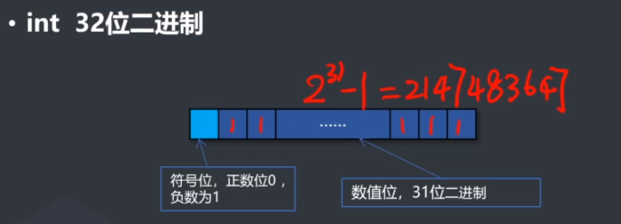
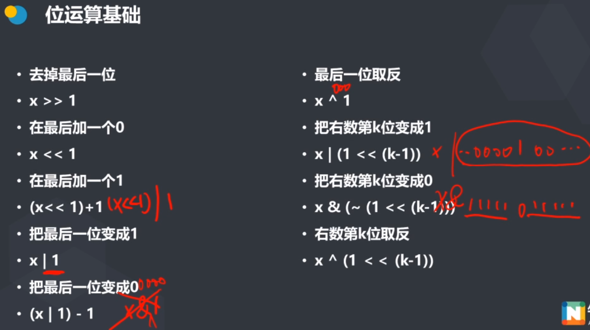

- 养成写题解的习惯
- 独立完成编码(建议思考半个小时再看题解，不要看着别人的代码敲自己的代码)
- 知其然也要知其所以然，多问几个为什么


## 枚举和贪心

### 算法

#### 一、什么是算法

明明想在学校中请一些同学一起做一项问卷调查，为了实验的客观性，他先用计算机生成了
N个1到1000之间的随机整数，对于其中重复的数字，只保留一个，把其余相同的数去掉。
然后再把这些数从小到大排序，按照排好的顺序去找同学做调查。请你协助明明完成“去重”与“排序”的工作。


- 几种解法：

1. 对数列进行去重
   ——没有标记的元素和他后面的元素两两比较，相同的则把后一个标记为不要，对去重之后
   的数组再排序（以冒泡为例）。

2. 对数列进行排序（以冒泡为例），然后从小到大遍历，若当前a[i]和a[i-1]相等就不输出，
   否则就可以输出。

3. 用一个数组b[i]表示i有没有出现过，每读入一个x ，就将b[x]赋值为1，表示x出现过了，
   最后从0到1000遍历b数组，如果b[i] =1 就输出i。


`算法是解题过程的准确而完整的描述。它是一个有限规则的集合，这些规则确定了求解某一
类问题的一个运算序列，对于某一类问题的任何初始输入，它能机械地一步一步地计算，并
且通过有限步骤之后，计算终止并产生输出。`

算法的特征：

1. 有穷性：一个算法必须总是在执行有限步之后结束。
2. 确定性：算法的每一个步骤必须是确切地定义的。
3. 输入：一个算法 有0个或多个输入。
4. 输出：一个算法有1个或多个输出。
5. 可行性：算法中要执行的每一个计算步骤都是可以在有限时间内完成的.


#### 二、怎样评价一个算法？

1. 正确性
2. 可读性
3. 健壮性（容错性）——对不规范数据的处理能力（竞赛中一般不考虑）
4. 时间复杂度
5. 空间复杂度

#### 三、时间复杂度

- 时间复杂度是衡量程序的运行速度的量度，它在衡量的时候忽略了硬件的差异。
- 它是一个定性描述程序运行时间和数据规模n的关系的函数，这个函数即程序执行
- 基本操作（加减寻址赋值简单的数学函数等）的次数，记做 T(n)


常见的时间复杂的

- O(1) 和输入数据规模无关
- O(logn) 一般我们默认底数是2，不是2也没关系，用换底公式之后就是常数了
- O(√𝑛) • O(n) 线性时间复杂度
- O(n^2)^
- O(n^3)……^
- O(C^n) C是一个常数，指数级
- O(n!) 阶乘级

10^8^左右可以出结果，9*10^8^可能会超时



### 枚举

优化枚举的基本思路：——减少枚举次数
1. 选择合适的枚举对象
2. 选择合适的枚举方向——方便排除非法和不是最优的情况
3. 选择合适的数据维护方法——转化问题


```c++
// 尺取法代码，简单测试了一下，应该没有问题
#include<iostream>
using namespace std;
int main(){
    int a[15];
    for(int i = 0; i < 15; i++) a[i] = i;
    int s = 16;
    int r = 0,l = 0;
    int res = 0;
    int temp = 0;
    int flag = 1;
    for(int i = 0; i < 15; i++){
        if(temp < s){
            temp += a[r++];
        }else{
            if(flag){
                res = temp;
                flag = 0;
            }else{
                if(temp < res) res = temp;
            }
            temp -= a[l++];
            
        }
    }
    cout << res << endl;
    return 0;
}
```





### 贪心

在对问题求解时，总是做出在当前看来是最好的选择，也就是说，不从整体最优上加以考虑，他所做出的是在某种意义上的局部最优解

能够使用贪心算法的问题都是能严格证明贪心出的局部最优解就是所求的全局最优解

**每次都选看起来最好的**


